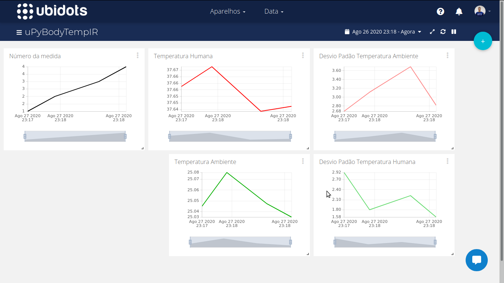
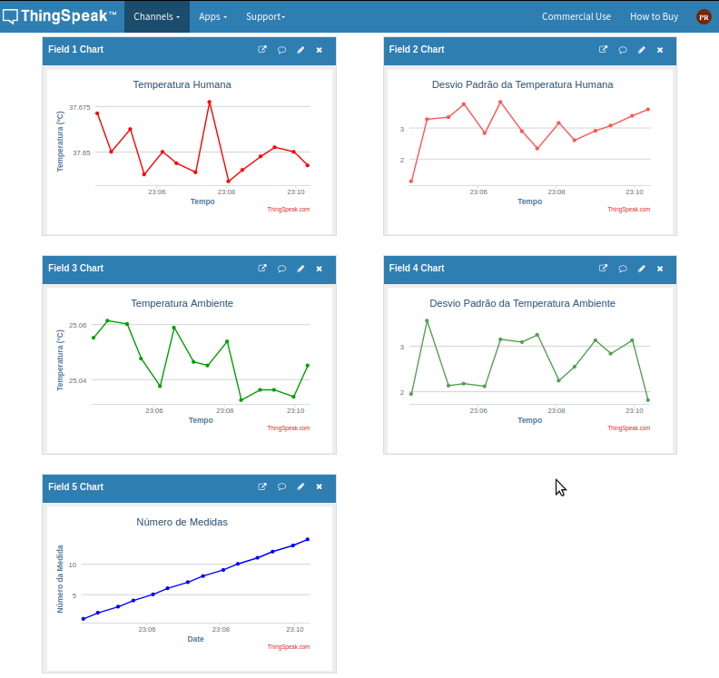
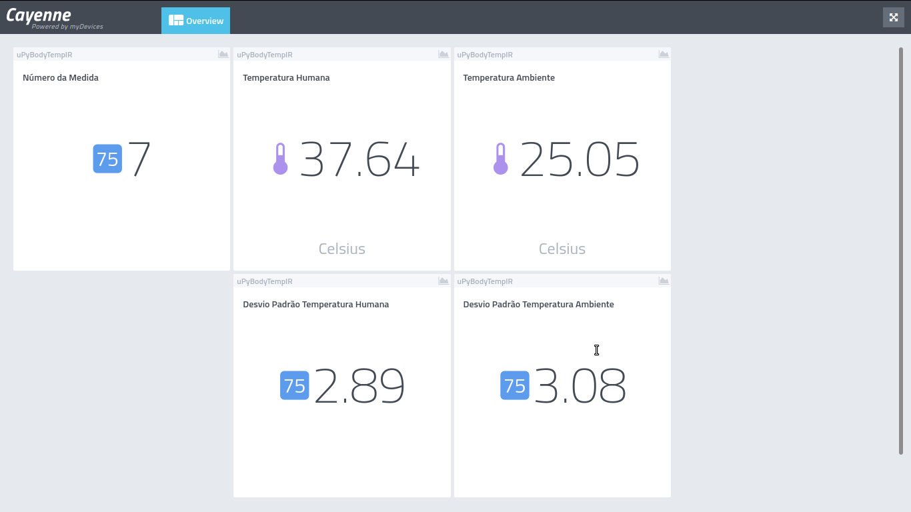

# uPyBodyTempIR

### uPyBodyTempIR -  Body Temperature IR Meter with MLX90615 sensor and MicroPython microcontroller

#### Goal : a low cost and open device to detect human body (head) temperature to help detect fever (due to covid-19 or not), using IoT (when available).

This project belongs to the initiative https://github.com/rcolistete/CompFis_UFES_covid19

The [I2C sensor MLX90615](https://www.melexis.com/en/product/mlx90615/) is a infrared thermometer for non-contact temperature measurements, with accuracy of +/- 0.2 C for human temperatures, so fever can be detected. 

There is no MLX90615 MicroPython driver yet, but there is a [MLX90614 MicroPython driver](https://github.com/mcauser/micropython-mlx90614), so it will be tested with MLX90615 to verify compatibility, if needed the driver will adapted. There is a also [MLX90614 CircuiPython driver](https://circuitpython.readthedocs.io/projects/mlx90614/en/latest).

Another sensor which can be useful to avoid people interfacing with physical contact is the I2C sensor [APDS-9960 Digital RGB, Ambient Light, Proximity and Gesture Sensor](https://www.broadcom.com/products/optical-sensors/integrated-ambient-light-and-proximity-sensors/apds-9960). See this excellent [guide from Adafruit](https://www.adafruit.com/product/3595). APDS-9960 supports 4 simple gestures (left to right, right to left, up to down, down to up) directly but other combined gestures are possible by programming.

The development will use MicroPython. Initial versions will have only local screen output. Depending on the chosen microcontroller, te IoT will be added, sending the temperature measurements to IoT Cloud (to be chosen), where the date can be visualized, exported, have alarm of high body temperature, etc.

Planned versions :
- uPyBodyTempIR-ESP8266 with [Wemos D1 Mini ESP8266](https://docs.wemos.cc/en/latest/d1/d1_mini.html), which is a ESP8266 (WiFi) with many possible shields, including OLED display. It will have IoT via WiFi + MQTT to IoT Cloud;
- uPyBodyTempIR-M5StickC with [M5StickC](https://docs.m5stack.com/#/en/core/m5stickc), which is a ESP32 (WiFi + Bluetooth) + screen + 2 buttons + RTC + battery + connectors + case + etc. It will have IoT via WiFi + MQTT to IoT Cloud;
- uPyBodyTempIR-PyboardD with [Pyboard D](https://store.micropython.org/category/pyboard%20D-series), which has WiFi + Bluetooth. A [WBUS DIP68](https://store.micropython.org/product/WBUS-DIP68) + [1-4 TILE 6x6 RGB LED array](https://store.micropython.org/product/TILE-LED36) will be used. It will have IoT via WiFi + MQTT to IoT Cloud;
- uPyBodyTempIR-MicroBit with [BBC Micro:bit](https://microbit.org/get-started/user-guide/overview/) + some expansion board, which has 5x5 red LEDs, 2 buttons;
- uPyBodyTempIR-CLUE with [Adafruit CLUE nRF52840 Express](https://www.adafruit.com/product/4500), Which has Bluetooth, 1.3″ 240×240 Color display, many sensors including a APDS-9960, compatible with BBC Micro:bit boards;
- uPyBodyTempIR-LoPy4 with [Pycom LoPy4](https://pycom.io/product/lopy4/), which is a ESP32 (WiFi + Bluetooth) + 4MB PSRAM memory, LoRa & Sigfox. It will have IoT via LoRaWan (-> LoRaWan gateway -> TTN LoRaWan server) + IoT Cloud Cloud, useful for regions without WiFi coverage but with LoRaWan gateway coverage.

This project is being developed by [UFES (Federal University of Espírito Santo - Brazil)](http://ufes.br/) researchers and students, including ones from [LabNerds](https://nerds.ufes.br/en/).

### Images

In the image below you can see the data that was sent to the Ubidots IoT platform.

In the image below you can see the data that was sent to the ThingSpeak IoT platform.

In the image below you can see the data that was sent to the Cayenne-MyDevices IoT platform.

